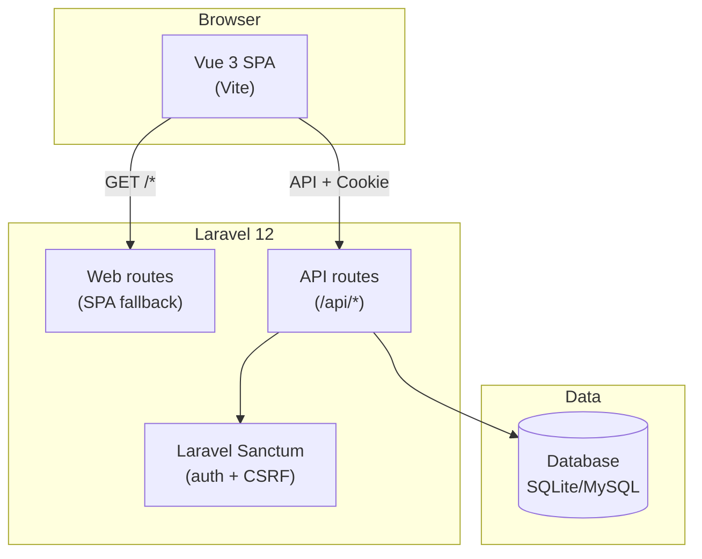
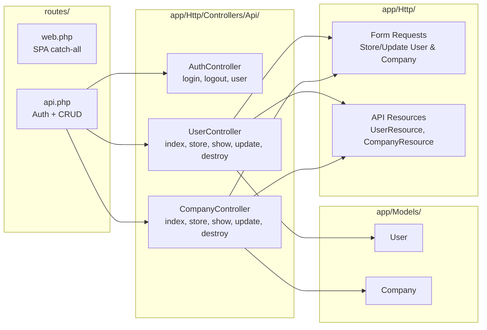
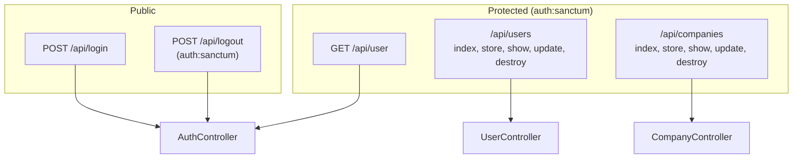
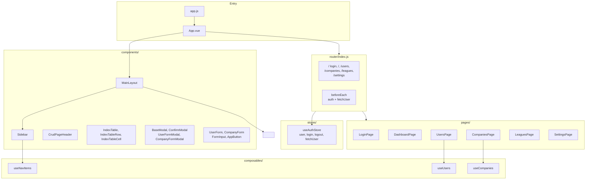
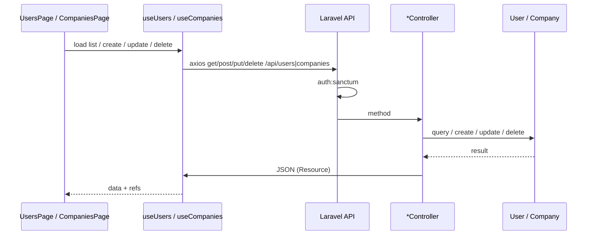

# Laravel App — Codebase Diagram

High-level and layered views of the codebase (Laravel 12 API + Vue 3 SPA).

---

## 1. High-level architecture



- **Web**: `routes/web.php` serves the SPA for all paths (`/{any}` → `app` view).
- **API**: `routes/api.php` defines REST endpoints; protected routes use `auth:sanctum`.
- **Sanctum**: stateful API auth (session/cookies) and CSRF for the SPA.

---

## 2. Backend (Laravel) structure



- **Controllers**: `AuthController` (login, logout, user), `UserController` and `CompanyController` (apiResource).
- **Models**: `User` (auth), `Company` (CRUD); no relation between them in the current code.
- **Http**: Form Requests for validation; Resources for JSON shaping.

---

## 3. API route map



---

## 4. Frontend (Vue) structure



- **App.vue**: Shows loading until router is ready; then either `MainLayout` (authenticated) or `<router-view>` (e.g. login).
- **Router**: All app routes plus `beforeEach` that runs `fetchUser` once and enforces `requiresAuth` / `requiresGuest`.
- **Auth**: Pinia `useAuthStore` talks to `/api/login`, `/api/logout`, `/api/user` and drives auth state.
- **Pages**: One page per main section; Users and Companies use composables for API + UI state.
- **Components**: Shared layout, sidebar, CRUD header, table primitives, modals, and form pieces.

---

## 5. Request flow (authenticated CRUD)



---

## 6. Directory tree (relevant parts)

```
laravel-app/
├── app/
│   ├── Http/
│   │   ├── Controllers/Api/   → AuthController, UserController, CompanyController
│   │   ├── Requests/          → Store/Update User & Company
│   │   └── Resources/         → UserResource, CompanyResource
│   ├── Models/                → User, Company
│   └── Providers/
├── bootstrap/app.php          → Web + API routes, statefulApi()
├── config/
├── database/
│   ├── migrations/            → users, companies, personal_access_tokens, cache, jobs
│   ├── factories/
│   └── seeders/
├── public/
├── resources/
│   ├── js/
│   │   ├── App.vue
│   │   ├── app.js
│   │   ├── router/index.js
│   │   ├── stores/useAuthStore.js
│   │   ├── composables/       → useUsers, useCompanies, useNavItems
│   │   ├── pages/             → Login, Dashboard, Users, Companies, Leagues, Settings
│   │   └── components/        → layout, table, modals, forms
│   ├── views/app.blade.php    → SPA root view
│   └── css/
├── routes/
│   ├── web.php                → SPA catch-all
│   └── api.php                → auth + users + companies
└── tests/
```

---

You can render the Mermaid blocks in GitHub, VS Code (with a Mermaid extension), or [mermaid.live](https://mermaid.live).
